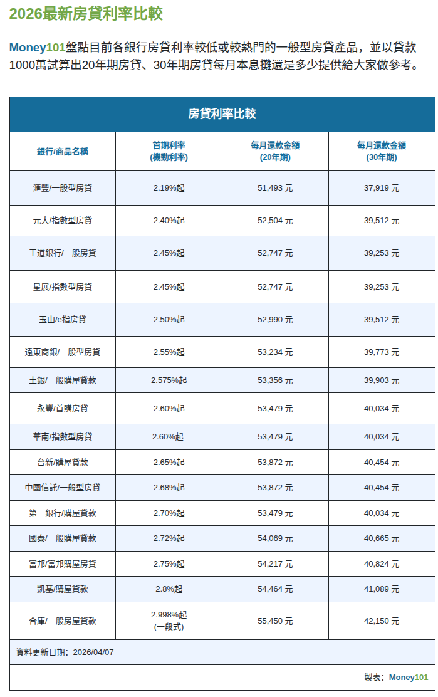
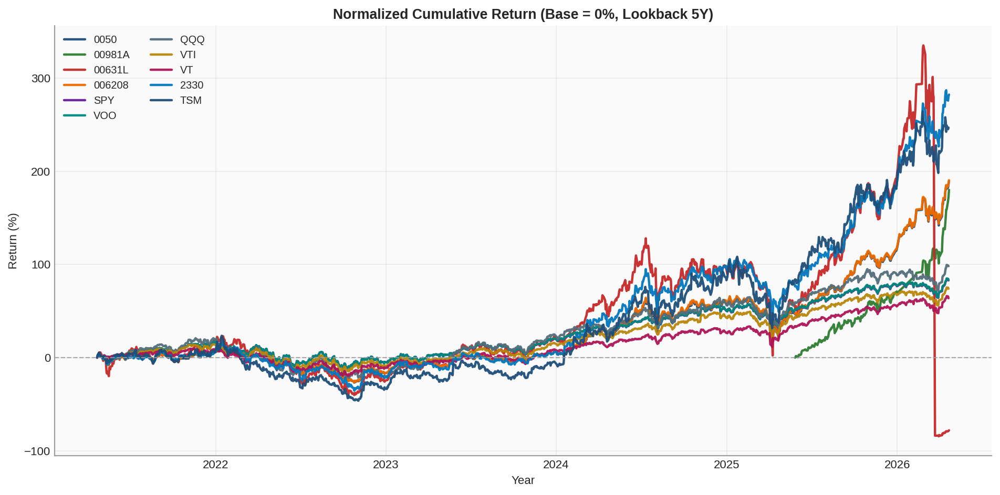

### 2026 房貸利率比較圖


### 房貸基本名詞解釋

| 術語 | 解釋 |
| :--- | :--- |
| **【房貸基本名詞】** | |
| 房貸成數 (LTV) | 貸款金額占房屋成交價或鑑價的比例。成數越高，自備款需求越低。 |
| 自備款 | 買房時需自行準備的資金，通常是房價扣掉可貸款金額後的差額。 |
| 貸款年限 | 房貸可攤還的總年數（如 20 年、30 年、40 年），年限越長月付較低但總利息通常較高。 |
| 本息攤還 | 每期固定或近似固定月付，內含本金與利息，前期利息占比高、後期本金占比高。 |
| 本金攤還 | 每期償還固定本金，利息按剩餘本金計算，月付會隨時間下降。 |
| 寬限期 | 一段期間內可只繳利息不還本金，寬限期結束後月付金通常會明顯上升。 |
| 固定利率 | 在約定期間內利率不變，還款金額較可預期。 |
| 機動利率 | 利率會隨市場或指標利率調整，月付可能上升或下降。 |
| 一段式 / 分段式利率 | 一段式是同一利率到底；分段式是前低後高或分期調整，需看整體平均成本。 |
| 總費用年百分率 (APR) | 將利率、手續費、開辦費等合併換算為年化成本，用來公平比較不同貸款方案。 |
| 綁約期 | 在約定期間內若提前清償或轉貸，可能需支付違約金。 |
| 提前清償違約金 | 綁約期間內提前還款產生的費用，常按提前清償金額的一定比例計算。 |
| 轉貸 | 將原房貸移轉到另一家銀行，目的通常是降低利率、延長年限或整合條件。 |
| 增貸 | 在原房屋擔保下增加貸款額度，通常需評估房屋現值、原貸餘額與還款能力。 |
| 二胎房貸 | 同一房屋再設定第二順位抵押貸款，利率通常高於一胎，風險也較高。 |
| 每月應繳金額 | 每期需支付的金額，會受到利率型態、年限、寬限期與還款方式影響。 |
| 總利息成本 | 貸款期間全部支付的利息總和，評估方案不能只看月付，還要看總利息。 |

### 股票基本名詞解釋

| 術語 | 解釋 |
| :--- | :--- |
| **【基本術語與財務指標】** | |
| 股票 (Stock) | 代表一間公司的部分所有權。買入股票等於成為該公司股東。 |
| EPS (每股盈餘) | Earnings Per Share。公司這段期間「為每一股賺了多少錢」，是衡量公司獲利能力的基本指標。 |
| 本益比 (P/E Ratio) | Price-to-Earnings Ratio。股價除以 EPS。代表「投資回本需要幾年」，用來評估股價當下是昂貴還是便宜。 |
| 股價淨值比 (P/B Ratio) | Price-to-Book Ratio。股價除以每股淨值。通常用於評估金融股或景氣循環股的合理價位。 |
| ROE (股東權益報酬率) | Return on Equity。公司拿股東的錢去投資的報酬率，數值越高代表公司替股東賺錢的效率越好。 |
| 現金股利 / 股票股利 | 公司將獲利發放給股東。發放現金稱為現金股利（配息）；發放股票稱為股票股利（配股）。 |
| 殖利率 (Dividend Yield) | 現金股利除以買進股價。代表「買進這檔股票，每年能拿到多少比例的現金配息」。 |
| **【ETF 專屬術語】** | |
| ETF (指數股票型基金) | Exchange Traded Fund。將指數單純化成一檔股票在交易所買賣。買入一檔 ETF 等於買進一籃子股票，能分散單一公司風險。 |
| 被動式 ETF (Passive ETF) | 目標是追蹤特定指數，不主動選股。重點是「跟上市場/指數表現」。 |
| 主動式 ETF (Active ETF) | 由基金經理人主動調整持股與權重，目標是「超越基準指數」。 |
| 成分股 | 組成該檔 ETF 的所有個別股票。成分股的權重與表現會直接決定 ETF 的價格走勢。 |
| 淨值 (NAV) | ETF 所持有的一籃子股票與資產的真實總價值，除以 ETF 的發行股數。是 ETF 的「真實價格」。 |
| 市價 | 投資人真正在股票市場上買賣 ETF 的價格。由市場供需決定，會圍繞著「淨值」波動。 |
| 折價 / 溢價 | 當市價「低於」淨值稱為折價（買得比真實價值便宜）；當市價「高於」淨值稱為溢價（買得比真實價值貴，有買貴風險）。 |
| 內扣費用 (Expense Ratio) | 總開銷費用。包含經理費、保管費、換股交易手續費等。這些費用會「直接從 ETF 的淨值中扣除」，投資人不用另外繳交，但會吃掉長期報酬。 |
| 追蹤誤差 | ETF 的報酬率與其所追蹤的「標的指數」報酬率之間的差距。誤差越小，代表該 ETF 管理品質越好。 |
| **【台股專屬術語】** | |
| 加權指數 (TAIEX) | 台灣證券交易所發行量加權股價指數。反映台灣整體股市表現的指標，台積電等權值股對其影響極大。 |
| 零股交易 | 買賣單位不足一張（1000股）的股票交易。最低買賣單位為 1 股，分為盤中零股與盤後零股交易。 |
| 交割 (T+2) | 台股獨特的資金清算制度。今天（T日）買賣股票，帳戶實際扣款或入帳是在「兩個交易日後（T+2）的上午」。未在帳戶準備足夠現金會導致違約交割。 |
| 除權 / 除息 | 公司發放股票股利（除權）或現金股利（除息）後，從股價中扣除相應價值的過程。這會導致除權息當天股價看起來「掉下來」。 |
| 填權 / 填息 | 除權息後，股價成功上漲回到除權息前的價格，代表投資人真正把股利賺進口袋。若持續下跌則稱為「貼息」。 |
| 三大法人 | 外資、投信（國內基金公司）、自營商（證券公司自營部）。他們資金龐大，動向對台股影響深遠。 |
| 融資 / 融券 | 信用交易。融資是「向券商借錢買股票」（做多）；融券是「向券商借股票來賣，之後再買回來還」（做空）。 |
| 處置股 | 當某檔股票近期漲跌幅過於劇烈，被交易所列入觀察或限制交易方式（如延長撮合時間、需先預扣款券），俗稱「關廁所」。 |
| **【美股專屬術語】** | |
| 美股四大指數 | 道瓊工業指數（老牌巨頭）、S&P 500（美股最具代表性 500 強）、那斯達克指數（科技股為主）、費城半導體指數（半導體產業）。 |
| 無漲跌幅限制 | 美股個股沒有單日 10% 的漲跌幅限制，一天之內可能翻倍也可能腰斬。 |
| 熔斷機制 (Circuit Breaker) | 為了避免市場過度恐慌，當大盤指數或個股在短時間內暴跌（或暴漲）達到特定比例時，會強制暫停交易一段時間讓市場冷靜。 |
| ADR (美國存託憑證) | 外國公司（如台灣的台積電）為方便美國投資人交易，而在美國證券市場發行的股票憑證。 |
| 盤前 / 盤後交易 | 正常交易時間（美東 9:30 - 16:00）以外的延長交易時段。流動性較差，但常是對財報發布的快速反應時間。 |
| 夏令 / 冬令時間 | 美國有日光節約時間。夏令時段台股對應的開盤時間為台灣時間 21:30；冬令時段則延後一小時，為台灣時間 22:30 開盤。 |
| 複委託 (Sub-brokerage) | 台灣投資人透過國內券商「委託」國外券商買賣美股的機制。好處是方便且有國內法規保障，缺點是手續費通常較海外券商直接開戶高。 |
| **【交易與下單術語】** | |
| 市值 (Market Cap) | 公司總股本乘以股價，代表公司在市場上的總體估值規模。 |
| 流通股數 | 市場上可自由交易的股票數量，不含長期鎖定或限制出售部分。 |
| 成交量 / 成交值 | 成交量是成交股數；成交值是成交金額。用來觀察市場活躍程度。 |
| 週轉率 (Turnover Rate) | 一段時間內成交量相對流通股數的比例，反映股票換手頻率。 |
| 委買 / 委賣 | 投資人掛出的買單與賣單，會形成即時的買賣盤深度。 |
| 買賣價差 (Bid-Ask Spread) | 最佳委買價與最佳委賣價的差距。價差越小通常代表流動性越好。 |
| 市價單 / 限價單 | 市價單重視「成交速度」；限價單重視「成交價格上限或下限」。 |
| ROD / IOC / FOK | ROD 當日有效；IOC 可部分成交、剩餘取消；FOK 必須全數立即成交否則取消。 |
| **【成本、報酬與風險】** | |
| 手續費 / 交易稅 | 每次買賣會產生的交易成本。台股通常買賣都收手續費，賣出另有證交稅。 |
| 損益兩平價 | 把買進成本、賣出成本、稅費都算入後，真正不賺不賠的價格。 |
| 年化報酬率 | 將不同期間報酬換算為每年平均報酬，方便比較不同投資策略。 |
| 波動度 (Volatility) | 報酬率的起伏程度，通常用標準差衡量。波動越大，風險通常越高。 |
| 最大回撤 (MDD) | 資產從高點下跌到低點的最大幅度，用來衡量最壞情境風險。 |
| Sharpe Ratio | 單位風險可換得的超額報酬，常用來比較不同策略的風險效率。 |
| Beta / 相關係數 | Beta 衡量個股相對大盤敏感度；相關係數衡量兩資產報酬同向程度。 |
| **【信用交易進階術語】** | |
| 融資維持率 | 券商用來監控信用部位風險的核心指標，過低可能被追繳或處分。 |
| 追繳 (Margin Call) | 維持率低於門檻時，券商要求投資人補保證金或擔保品。 |
| 斷頭 | 未能在期限內補足追繳款時，券商強制賣出持股或回補部位。 |
| 借券賣出 | 向券源借入股票後先賣出，預期股價下跌再買回歸還以賺取價差。 |
| 券資比 | 融券餘額相對融資餘額或成交量的比率，常用來觀察軋空風險。 |
| 軋空 (Short Squeeze) | 股價快速上漲迫使空方停損回補，進一步推升股價的連鎖現象。 |
| **【ETF、稅務與匯率】** | |
| ETF 配息來源 | 可能來自股利收入、資本利得、平準金等，來源不同影響可持續性判讀。 |
| 總報酬 (Total Return) | 含配息再投入的完整報酬，比單看價差更能反映長期績效。 |
| W-8BEN | 非美國居民投資美股常見稅務表單，用於確認身分與適用預扣稅率。 |
| 預扣稅 (Withholding Tax) | 美股股利常先被預扣一定比例稅款，實際入帳金額會低於公告股利。 |
| 匯率風險 | 投資外幣資產時，報酬會同時受到標的價格與匯率變動影響。 |
| 已實現損益 / 未實現損益 | 已實現是賣出後落袋的結果；未實現是持有中帳面浮動損益。 |
| 再平衡 (Rebalancing) | 定期調整資產配置比例回到原設定，用來控制風險與偏離。 |

### ETF 實例說明（常見標的）

| 代號 | 類型 | 追蹤標的 / 特色 | 一句話理解 |
| :--- | :--- | :--- | :--- |
| 0050 | 台股市值型 ETF | 追蹤台灣大型權值股（市值前段） | 想投資「台灣大盤核心公司」的代表工具。 |
| 00981A | 台股主動式 ETF | 經理人主動調整持股，通常偏中小型或主題型配置 | 想要「主動選股策略」而非單純追蹤指數的工具。 |
| 0050 正二 | 槓桿 ETF（2x） | 目標為「單日」約 2 倍報酬 | 適合短線交易，不適合長期無腦持有。 |
| 006208 | 台股市值型 ETF | 同樣屬於台灣大型股市場曝險 | 與 0050 性質接近，常拿來比較費用與流動性。 |
| SPY | 美股 ETF（S&P 500） | 追蹤美國 500 大公司 | 美股大盤代表，流動性高。 |
| VOO | 美股 ETF（S&P 500） | 同樣追蹤 S&P 500 | 和 SPY 核心曝險接近，常比較費率與交易需求。 |
| QQQ | 美股 ETF（NASDAQ-100） | 科技權重高，成長股風格明顯 | 想偏重科技與成長，波動通常也更高。 |
| VTI | 美股 ETF（全市場） | 幾乎涵蓋美國大中小型股 | 一檔打包「整個美國股市」。 |
| VT | 全球 ETF（全市場） | 美國 + 非美國市場一次打包 | 一檔做全球分散，降低單一國家集中風險。 |
| 2330 | 台股個股 | 台積電股票 | 台灣半導體龍頭，全球晶圓代工領導者。 |
| TSM | 美股個股 | 台積電 ADR | 台積電在美國的存託憑證，方便美國投資人交易。 |

### ETF 補充問答

- Q: 0050 是主動式 ETF 嗎？
- A: 不是。0050 屬於被動式 ETF，主要追蹤台灣 50 指數。

- Q: 00981A 是什麼？
- A: 00981A 是一檔台灣主動式 ETF，重點是經理人主動調整持股，與 0050 的被動追蹤邏輯不同。

### ETF 年化報酬快照（自動更新）

<!-- ETF_CAGR_AUTO:BEGIN -->
| 名稱 | 輸入代號 | Yahoo 代號(解析後) | 年化報酬（估算） | 計算區間 | 計算方式 | 期間內分割事件 |
| :--- | :--- | :--- | :--- | :--- | :--- | :--- |
| 0050 | 0050 | 0050.TW | 23.68% | 2021-04-22 ～ 2026-04-22 | 近5年 | 無 |
| 00981A | 00981A | 00981A.TW | 212.52% | 2025-05-27 ～ 2026-04-22 | 可得資料以來 | 無 |
| 0050 正二 | 0050 正二 | 00631L.TW | -26.14% | 2021-04-22 ～ 2026-04-22 | 近5年 | 無 |
| 006208 | 006208 | 006208.TW | 23.76% | 2021-04-22 ～ 2026-04-22 | 近5年 | 無 |
| SPY | SPY | SPY | 12.84% | 2021-04-22 ～ 2026-04-21 | 近5年 | 無 |
| VOO | VOO | VOO | 12.91% | 2021-04-22 ～ 2026-04-21 | 近5年 | 無 |
| QQQ | QQQ | QQQ | 14.66% | 2021-04-22 ～ 2026-04-21 | 近5年 | 無 |
| VTI | VTI | VTI | 11.71% | 2021-04-22 ～ 2026-04-21 | 近5年 | 無 |
| VT | VT | VT | 10.37% | 2021-04-22 ～ 2026-04-21 | 近5年 | 無 |
| 2330 | 2330 | 2330.TW | 30.76% | 2021-04-22 ～ 2026-04-22 | 近5年 | 無 |
| TSM | TSM | TSM | 28.26% | 2021-04-22 ～ 2026-04-21 | 近5年 | 無 |

註：使用 Yahoo Finance 調整後收盤價（auto-adjust）估算 CAGR，優先取近 5 年；若歷史不足則改用可得資料以來。
代號解析：若輸入純數字（如 `0050`、`2330`），會優先嘗試 `.TW`、`.TWO`。
分割說明：分割事件已列出；`auto-adjust` 價格已做分割還原，長期走勢不會只由分割本身造成。
公式：`(期末/期初)^(1/年數)-1`。

主圖為「起點標準化累積報酬」（每檔基準日 = 0%），比較基準一致。



[開啟完整 HTML 報表（含每年報酬表）](../figure/asset-report-5y.html)
<!-- ETF_CAGR_AUTO:END -->

### 報表腳本使用規則

1. 只維護 `ETF 實例說明（常見標的）` 表格第一欄（代號）。新增代號後，腳本會自動納入計算。
2. 正式腳本名稱是 `asset_performance_report.py`，舊的 `etf_cagr.py` 只是相容轉呼叫入口。
3. 預設資料來源是 Yahoo Finance「調整後收盤價（auto-adjust）」。
4. 主要輸出：
   - Markdown 自動區塊（本檔 `ETF 年化報酬快照（自動更新）`）
   - PNG 主圖（起點 0% 的標準化累積報酬）
   - HTML 報表（含每年報酬表）

常用指令：

```bash
# 只在終端顯示（不寫回 md）
python3 /home/hsuyueh.chuang/Desktop/vscode/github/other-notes/investment/asset_performance_report.py --years 5

# 更新 loan-stock.md 自動區塊 + 產生 PNG/HTML
python3 /home/hsuyueh.chuang/Desktop/vscode/github/other-notes/investment/asset_performance_report.py --years 5 --write-md /home/hsuyueh.chuang/Desktop/vscode/github/other-notes/investment/loan-stock.md

# 指定自訂標的（不讀 md 表格）
python3 /home/hsuyueh.chuang/Desktop/vscode/github/other-notes/investment/asset_performance_report.py --years 10 --symbols "0050,SPY,AAPL,2330,QQQ"
```

可選參數：

- `--symbols-from-md <path>`：指定要解析哪個 md 的表格第一欄。
- `--plot-output <path>`：指定 PNG 輸出路徑。
- `--html-output <path>`：指定 HTML 輸出路徑。
- `--no-plot`：不產生 PNG。
- `--no-html`：不產生 HTML。
